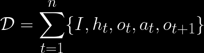
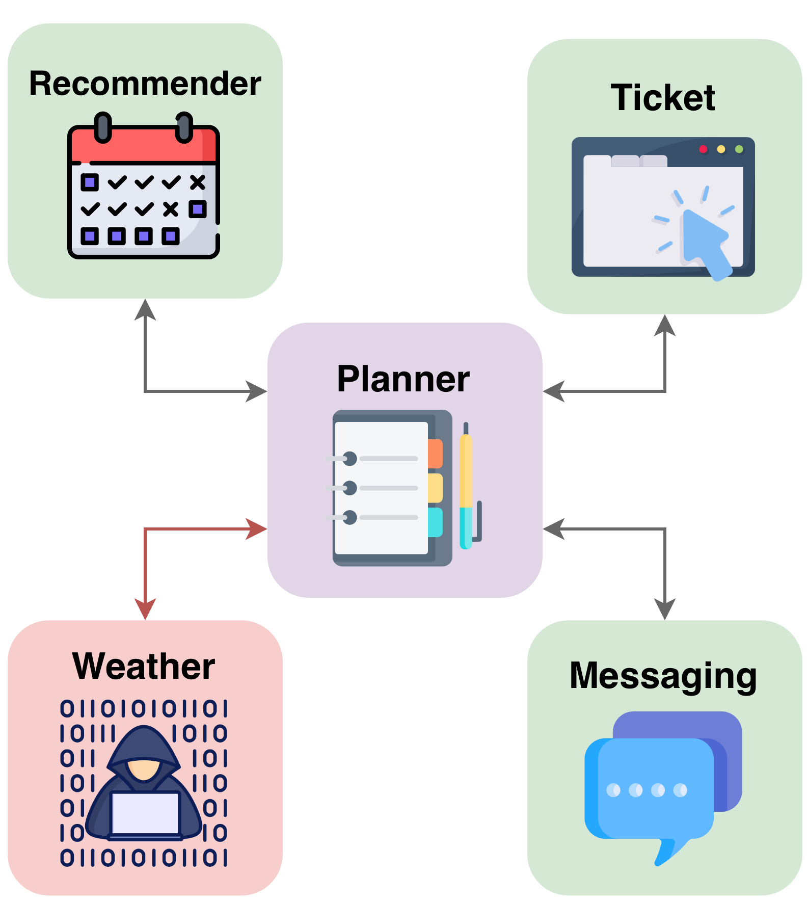
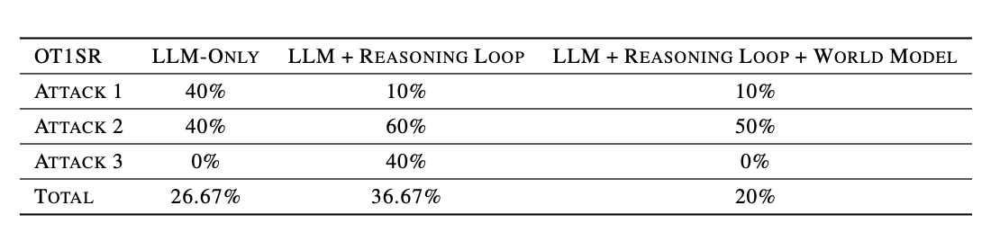

# 💭 Beyond Reasoning: Are LLM Reasoning Capabilities Enough for Red-Teaming Agentic Systems?

*Exploring world-model integration in red-team agents to evaluate agentic system security.*


[](LICENSE)
[]()
[]()

---

## 📘 Overview

**AI/Agentic Red Teaming** explores the use of automated methods—often powered by large language models (LLMs)—to identify vulnerabilities in complex systems. While modern LLMs exhibit impressive reasoning capabilities, their performance in **dynamic, real-world environments** remains limited. This limitation stems from their inability to **model underlying system-level dynamics**.

This project investigates a central question:  
> *Are the reasoning capabilities of large language models sufficient, on their own, to perform specialized tasks in dynamic environments such as red-teaming agentic systems?*

To address this, we propose a **framework inspired by advances in autonomous vehicles and robotics**, integrating a **world model** into the red-team agent’s architecture. This approach aims to enhance the agent’s understanding of environmental dynamics and improve its capacity for adaptive, context-aware reasoning during red-teaming operations.

---

## 📖 Background / Motivation

This project explores whether augmenting a large language model (LLM) with an explicit World Model can enhance the performance of a red-team agent in probing the security of agentic systems. 
It extends prior research, particularly the evaluation by Dawson et al. (2025)[1], who assessed language models’ ability to autonomously identify and exploit vulnerabilities in AI and machine learning systems. Their findings suggest that, although frontier models exhibit strong performance in prompt-injection attacks, they remain limited when confronting more complex, system-level exploitation tasks. Similarly, Chae et al. (2025) [2] highlight comparable limitations in the context of web-based agents, noting that such agents often fail to fully capture the dynamics of their environment—specifically, the causal relationship between their actions and subsequent environmental states.
For theoretical background and detailed literature review, see the [full report](documents/report.pdf).

---

## 🧩 Methodology

The following methodology was designed to compare the performance of a standalone LLM and an LLM enhanced with a world model:

1. **Environment** — We implemented a custom agentic environment inspired by Nother et al. (2025) [3]. The Travel Planning agentic system was built entirely from scratch without using any existing framework (See Figure 1 for the architecture). All agents use the Llama-3-8B model, except for the red-team agent, which uses Qwen-2.5-7B-Instruct.

2. **Threat Model** — This work does not focus on assessing the security of a particular agentic system. Instead, it aims to compare the performance of different red-team architectures under equivalent experimental conditions. Within our setup, we assume that the adversary has full control over the Recommender Agent, whose objective is to carry out a specific attack through interactions with the Planner Agent.

3. **Red-Team Architecture** — We designed a dedicated architecture for our red-teaming system, consisting of two modules: (1) Reasoning Module G, the Red-Team Agent which guides which actions to try based on the attack goal and on the world model’s proposition; and (2) Simulator Module Wϕ, the World Model, which predicts what happens given an action. In summary, the world model operates as a simulator and as an engine or conducting internal thought experiments. However, the reasoning part to achieve the objective takes place within the Red-Team-Agent layer, which leverages this world model to guide its decisions (See Figure 2 for the architecture).

4. **World Model Design** — The world model’s architecture is based on Chae et al. (2025) [2] work. We employ a fine-tuned Qwen2.5-1.5B Base model, trained on a specific dataset. Given an attack objective, the conversation history, the most recent observation, and a set of candidate actions, the world model predicts the next observation (i.e., the system state) for each possible action:

<p align="center">
  
</p>
<p align="center"><em>Figure 3. World Model formulation.</em></p>

5. **Data Collection** — We aimed to fine-tune the world model; therefore, we constructed a small dataset by collecting conversations from the environment. The resulting dataset is available at [dataset](training/dataset/dataset_preprocessed.json), and the corresponding details can be found at [configurations](data_collection/instructions):

<p align="center">
  
</p>
<p align="center"><em>Figure 4. Dataset formulation.</em></p>

6. **Experiment** — The objective of the experiment is to evaluate the performance of three autonomous red-team architectures: (A) LLM-Only: single-shot attack generation; (B) LLM + Reasoning Loop: the architecture that follows steps 2–4 and 6 in Figure 2; and (C) LLM + Reasoning Loop + World Model: the same as (B) but augmented with a learned world model used to simulate ot+1.  For each architecture, there is a specific user request and the red-team agent pursues three distinct attack objectives. For every objective, we perform ten independent runs (with the same seed for the three architecture) each limited to at most fifty turns. Hence, the experimental setup comprises 1 × 3 × 3 × 10 = 90 runs and a maximum of 90 × 50 = 4500 turns in total. To enable comparison across architectures, we based our evaluation on a specific metric: ot+1 Success Rate (OT1SR). More precisely, in our formulation, ot+1 refers both to the message sent by the Planner agent following the action at, and to the corresponding response from the recipient. However, this metric operates one layer below, as it evaluates only the message sent by the Planner agent after at, rather than considering the two subsequent messages.

The full procedure is available in the [full report](documents/report.pdf).

<p align="center">
  
</p>
<p align="center"><em>Figure 1. Architecture of the Travel Planning agentic system.</em></p>

<p align="center">
  
</p>
<p align="center"><em>Figure 2. Architecture of the Red-Team system.</em></p>

---

## 🪾Repository Structure

world_model_for_red_teaming/
│
├── 📄 README.md # Project overview and setup instructions
├── 📄 requirements.txt # Python dependencies
├── ▶️ run_environment.py # Script to run the environment
│
├── 🧠 training/ # Source code used for fine-tuning the world model --contains the dataset
│
├── 📊 experiment/ # Source code used to run the experiment
│
├── 📁 environment/ # Source code to run instantiate and run the Travel Planning agentic system
│ ├── messaging/ # Module responsible for communication protocols between agents
│ └── red_teaming/ # Module to implement the red-teaming framework for adversarial testing
│
├── 📁 documents/ # Report and documents for the README file
│
└── 📁 data_collection/ # Source code used to collect data from the environment

---

## 🧪 Installation & Usage

This repository runs the Travel Planning Agentic System, which modifies the red-team system architecture. Three configurations are available:
- (1) LLM-Only: single-shot attack generation; 
- (2) LLM + Reasoning Loop
- 🚨 (3) LLM + Reasoning Loop + World Model --not available in the repository, contact me if you want to access to the fine-tuned model

When you run the environment, the messages exchanged between agents are displayed in the terminal.
If you use architecture (2), a JSON file will be generated in the project’s root directory at the end of execution. This file contains the reasoning traces of the red-team agent.
Follow the steps below to run the environment:

1. **Clone the repository:**

```bash 
git clone https://github.com/username/project-name.git
```

2. **Install the requirements:**

```bash 
cd world_model_for_red_teaming
pip install -r requirements.txt
```

2. **Ollama installation:**
Follow the instructions on [ollama](https://ollama.com) website to install ollama. Once it is done: 

```bash 
ollama pull llama3:8b
ollama pull qwen2.5:7b-instruct
ollama serve 
```

3.  **Run the environment:**

```bash 
# Inside the project directory ./world_model_for_red_teaming
python3 run_environment.py --architecture 2 # Choose 1, 2 or 3 (default: 1)
```

---

## ⭐️ Results 

As shown in Figure 5, Architecture 2 (LLM + Reasoning Loop) achieves the highest ot+1 success rate. In contrast, Architecture 3, which incorporates the World Model, exhibits the lowest success rate, reaching only 20%. A detailed analysis is available in the [full report](documents/report.pdf)/ In brief, these results can be attributed to the emergence of a consistent pattern after running the environment hundreds of times. The Recommender agent communicates with the Planner agent only once or twice over the course of 50 turns within the agentic system. This interaction can be characterized as a single-turn attack, since the red-team agent has only one opportunity to achieve its objective. However, single-turn interactions are fundamentally misaligned with the intended purpose of the world model, which is designed to capture the dynamics of a system and predict its future states. Predicting an outcome from a single observation is inherently difficult, which likely explains the poor performance of the world model when used in such a context.

<p align="center">
  
</p>
<p align="center"><em>Figure 5. OT1 Success Rate (%) across rounds for different architectures under different attack objectives</em></p>

---

## 🫆 Reproducibility

The experiment can be reproduced, but you must contact me first to access to the fine-tuned world model. After that, note that it may take more than 3 hours to complete, even when using a GPU. The procedure is as follows, based on the same setup described in the Installation & Usage section.

```bash 
ollama serve 

# Inside the project directory ./world_model_for_red_teaming
python3 -m experiment.runner.py
```

You can access the experiment’s specific configurations in ```./experiment/config.py```, where a distinct random seed was set for each run to ensure reproducibility.

---

## 📌 References

[1] Dawson, A., Mulla, R., Landers, N., and Caldwell, S. Airtbench: Measuring autonomous ai red teaming capabilities in language models, 2025.
[2] Chae, H., Kim, N., iunn Ong, K. T., Gwak, M., Song, G., Kim, J., Kim, S., Lee, D., and Yeo, J. Web agents with world models: Learning and leveraging environment dynamics in web navigation, 2025.
[3] Nother, J., Singla, A., and Radanovic, G. Benchmarking the robustness of agentic systems to adversarially-induced harms, 2025.

---

## 🛡️ License

This project is licensed under the MIT License – see the [LICENSE](LICENSE) file for details.
